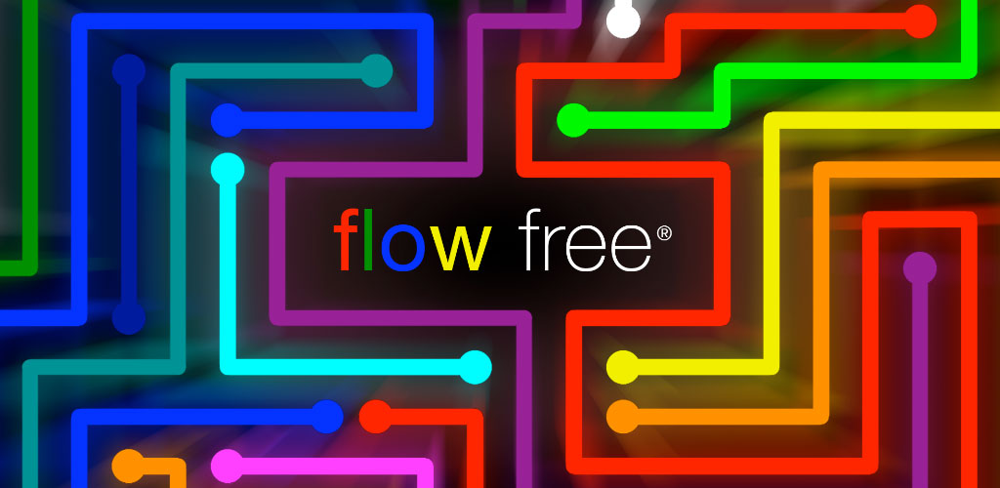

Flow Free es un adictivo juego de puzzles donde conectas círculos del mismo color con tuberías sin que se crucen. Se trata de una réplica del juego [Flow Free de Big Duck Games](https://www.bigduckgames.com/flowfree), creada con fines académicos para la asignatura de Desarrollo de Videojuegos Móviles.

## Características técnicas

- Desarrollo de **juegos móviles con Unity**
- Integración de anuncios con **UnityAds**
- Implementación de **sistemas de ayuda** y pistas
- Gestión de datos desde **ficheros de texto**
- Diseño de **interfaz adaptable** a diferentes resoluciones y relaciones de aspecto
- Implementación de **sistemas de progreso y guardado** del jugador
- Estructura de niveles organizada en categorias y paquetes con **ScriptableObjects**

## Gameplay

El objetivo principal del juego es **conectar los círculos del mismo color** mediante tuberías sin que se crucen, cubriendo todo el tablero. El jugador arrastra las tuberías para conectar los círculos, resolviendo puzzles de diferentes niveles de dificultad. El juego mantiene el interés con **nuevos niveles desbloqueables**, progreso registrado entre sesiones y la posibilidad de obtener pistas a través de anuncios recompensados.

## Controles

Tocar y arrastrar para conectar círculos con tuberías, seleccionar los niveles desde el menú e interactuar con todos los botones de la interfaz.

---
---

Flow Free is an addictive puzzle game where you connect circles of the same color with pipes without crossing them. It is a replica of the game [Flow Free by Big Duck Games](https://www.bigduckgames.com/flowfree), created with academic purposes for the Mobile Game Development subject.

## Technical features

- **Mobile game development with Unity**
- Advertisement integration with **UnityAds**
- Implementation of **help systems and hints**
- **Data management** from text files
- Design of an **adaptive interface** for different resolutions and aspect ratios
- Implementation of **progress and saving systems** for the player
- Level structure organized into categories and packages with **ScriptableObjects**

## Gameplay

The main objective of the game is to **connect circles of the same color with pipes** without crossing them, covering the entire board. The player drags the pipes to connect the circles, solving puzzles of varying difficulty levels. The game maintains interest with **unlockable new levels**, progress saved between sessions, and the possibility to obtain hints through rewarded ads.

## Controls

Touch and drag to connect circles with pipes, select levels from the menu, and interact with all interface buttons.
